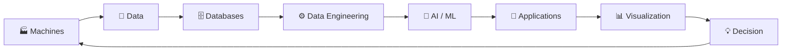

# 👋 Hey, I'm Yuvraj Singh

### `Data Engineer` · `Python Developer` · `AI/ML Builder` · `Industrial Analytics`

> I build systems where **data leaves the machine, travels through software, becomes intelligence, and finally reaches a decision.**

```text
                    ┌─────────────────────────────┐
                    │        PHYSICAL WORLD       │
                    │                             │
                    │  Machines • Sensors • MES   │
                    │  Production • Quality       │
                    └──────────────┬──────────────┘
                                   │
                                   ▼
                    ┌─────────────────────────────┐
                    │        DATA ENGINEERING      │
                    │                             │
                    │ SQL • Python • ETL • APIs   │
                    │ MSSQL • MySQL • Databricks  │
                    └──────────────┬──────────────┘
                                   │
                                   ▼
                    ┌─────────────────────────────┐
                    │          AI / ML             │
                    │                             │
                    │ PyTorch • TensorFlow        │
                    │ Computer Vision • LLMs      │
                    │ Text-to-SQL • Prediction    │
                    └──────────────┬──────────────┘
                                   │
                                   ▼
                    ┌─────────────────────────────┐
                    │        APPLICATIONS         │
                    │                             │
                    │ FastAPI • React • Python    │
                    │ Streamlit • Automation      │
                    └──────────────┬──────────────┘
                                   │
                                   ▼
                    ┌─────────────────────────────┐
                    │        DECISION LAYER       │
                    │                             │
                    │ Power BI • Dashboards       │
                    │ Alerts • Insights • Actions │
                    └─────────────────────────────┘
```

---

## 🧠 What I Do

I enjoy working at the intersection of:

**Manufacturing × Data × AI × Software**

My work ranges from building production dashboards and SQL pipelines to developing computer-vision inspection systems and LLM-powered analytics applications.

### My engineering loop



---

# 🛠️ Technology Universe

### Languages

```text
Python       ████████████████████
SQL          ███████████████████░
C / C++      ███████████████░░░░░
JavaScript   ███████████████░░░░░
Java         ████████████░░░░░░░░
TypeScript   ███████████░░░░░░░░░
R            █████████░░░░░░░░░░░
MATLAB       ████████░░░░░░░░░░░░
```

### Data Engineering

`Python` `SQL` `MSSQL` `MySQL` `PostgreSQL` `MongoDB`

`Apache Kafka` `ETL` `Data Modeling` `Databricks` `Pandas` `NumPy`

### AI / Machine Learning

`PyTorch` `TensorFlow` `Scikit-learn`

`Computer Vision` `ResNet` `ONNX` `TensorRT`

`LLM Applications` `Text-to-SQL` `Predictive Analytics`

### Backend / Application Development

`FastAPI` `Node.js` `React` `Streamlit`

`Django` `Firebase` `REST APIs`

### Cloud / DevOps

`AWS` `Azure` `GCP`

`Docker` `Kubernetes` `Jenkins`

### Analytics

`Power BI` `DAX` `SQL` `Data Modeling`

---

# 🔬 Some Things I've Built

## 👁️ Automated Optical Inspection

### `Computer Vision × Manufacturing`

A computer-vision inspection system for diesel injector components.

```text
Basler Camera
      │
      ▼
┌─────────────┐
│ Image       │
│ Acquisition │
└──────┬──────┘
       │
       ▼
┌─────────────┐
│ ResNet      │
│ Classifier  │
└──────┬──────┘
       │
       ├──► Defect
       │
       └──► OK
              │
              ▼
      Production Decision
```

### Stack

`Python` `PyTorch` `ResNet` `ONNX` `TensorRT`

`Basler Camera` `Computer Vision` `Label Studio`

⚡ **18 images inspected in ~3.6 seconds**

---

# 🤖 AI-Powered Data Intelligence Platform

### `LLM × SQL × Databricks`

A natural-language analytics system designed to allow users to ask questions about production data without manually writing SQL.

```text
                   USER
                     │
                     ▼
             "Show production
              performance..."
                     │
                     ▼
              ┌─────────────┐
              │     LLM     │
              └──────┬──────┘
                     │
                     ▼
               Text → SQL
                     │
                     ▼
              ┌─────────────┐
              │ Databricks  │
              │    Data     │
              └──────┬──────┘
                     │
                     ▼
               Query Result
                     │
                     ▼
          ┌───────────────────┐
          │ Chart / Insight   │
          └───────────────────┘
```

### Stack

`Python` `FastAPI` `Azure Databricks`

`LLMs` `Text-to-SQL` `Streamlit` `Plotly`

---

# 📊 Manufacturing Intelligence

I've worked on analytics around:

```text
Production
    │
    ├── OEE
    ├── Production Results
    ├── Quality
    ├── Cycle Time
    ├── Pneumatic Consumption
    ├── Line Performance
    └── Process KPIs
```

Including dashboards and analytics involving:

* MES data
* Production lines
* SQL-based reporting
* Power BI
* DAX
* Databricks
* Manufacturing KPIs
* Calendar-week / shift analytics
* Automated reporting

---

# 🏭 The Manufacturing → Software Connection

One of the things that interests me most is this:

```text
             REAL MACHINE
                  │
                  ▼
          ┌───────────────┐
          │     MES       │
          └───────┬───────┘
                  │
                  ▼
             DATABASE
                  │
                  ▼
             SQL / ETL
                  │
                  ▼
          ┌───────────────┐
          │   Analytics   │
          └───────┬───────┘
                  │
          ┌───────┴────────┐
          ▼                ▼
       Power BI           AI
          │                │
          └───────┬────────┘
                  ▼
              INSIGHT
                  │
                  ▼
              ACTION
```

The interesting part isn't just the dashboard.

**It's the entire chain.**

---

# 🧰 Projects & Experiments

| Project                          | Area                | Technology                  |
| -------------------------------- | ------------------- | --------------------------- |
| 👁️ Automated Optical Inspection | Computer Vision     | PyTorch / ResNet / TensorRT |
| 🤖 AI Data Intelligence          | GenAI / Data        | FastAPI / LLM / Databricks  |
| 📦 Packing Label System          | Industrial Software | Python / SQL Server         |
| 🧩 EDS Matching Tool             | ML / Automation     | Python / Random Forest      |
| 📈 Manufacturing Dashboards      | Analytics           | Power BI / DAX / SQL        |
| 🔄 Production Log Migration      | Data Engineering    | MySQL → MSSQL               |
| 📧 Vendor Confirmation System    | Automation          | Django / Oracle / Python    |
| 💬 Genie Analytics Interface     | GenAI               | Streamlit / Databricks      |
| 🏭 MES Analytics                 | Manufacturing       | SQL / Power BI / Databricks |

---

# 🌐 My Architecture Playground

```text
                         INTERNET
                            │
                ┌───────────┴───────────┐
                │                       │
             React                  Streamlit
                │                       │
                └───────────┬───────────┘
                            │
                           API
                            │
                         FastAPI
                            │
            ┌───────────────┼────────────────┐
            │               │                │
          Python          LLM              ML
            │               │                │
            └───────────────┼────────────────┘
                            │
                    ┌───────┴────────┐
                    │                │
                 Databricks       SQL Server
                    │                │
                    └───────┬────────┘
                            │
                         DATA
                            │
                    ┌───────┴────────┐
                    │                │
                 Power BI         Reports
```

---

# 📚 Currently Exploring

```text
┌────────────────────────────────────────────┐
│                                            │
│  🧠 Generative AI                         │
│  🏗️ Data Engineering                      │
│  ⚡ FastAPI                                │
│  ☁️ Cloud Architecture                    │
│  📊 Advanced Power BI                     │
│  🗄️ Data Modeling                         │
│  🤖 AI Agents                             │
│  🔍 Computer Vision                       │
│  🏭 Industrial AI                         │
│                                            │
└────────────────────────────────────────────┘
```

---

# 🧩 How I Think About Software

I like systems that follow this progression:

```text
              DATA
                ↓
             STRUCTURE
                ↓
            AUTOMATION
                ↓
          INTELLIGENCE
                ↓
             ACTION
```

Not:

```text
"Let's add AI."
```

But:

```text
"What problem exists?"
        ↓
"What data represents it?"
        ↓
"Can software automate it?"
        ↓
"Can ML improve it?"
        ↓
"Can AI make it easier to use?"
```

---

# 🧪 Engineering Philosophy

```python
def build_solution(problem):

    understand(problem)

    data = collect(problem)

    clean(data)

    model = design_system(data)

    automate(model)

    measure(model)

    improve(model)

    return solution
```

---

# 📈 My Journey

```text
2022
 │
 ├── C / C++ / Programming
 │
 ▼
2023
 │
 ├── Web Development
 ├── Databases
 ├── Leadership / Technical Communities
 │
 ▼
2024
 │
 ├── Python
 ├── Machine Learning
 ├── Cloud
 │
 ▼
2025
 │
 ├── Bosch
 ├── Computer Vision
 ├── Manufacturing Data
 └── Industrial AI
 │
 ▼
2026
 │
 ├── Data Engineering
 ├── Databricks
 ├── Power BI
 ├── GenAI
 ├── Text-to-SQL
 └── Production Intelligence
 │
 ▼
2027+
 │
 └── Build systems that connect
     DATA → AI → SOFTWARE → REAL WORLD
```

---

# 🧠 The Bigger Picture

I don't see these as separate fields:

```text
             ┌──────────────┐
             │  DATA        │
             └──────┬───────┘
                    │
         ┌──────────┼──────────┐
         ▼          ▼          ▼
      SOFTWARE     AI       ANALYTICS
         │          │          │
         └──────────┼──────────┘
                    ▼
             REAL WORLD
```

A good engineer should be able to move between all four.

---

# ⚡ GitHub Activity

<div align="center">

<!-- Replace USERNAME with your GitHub username -->


</div>

---

# 🐍 Contribution Snake

<div align="center">

<!-- Enable the GitHub Actions workflow that generates
     github-contribution-grid-snake.svg -->


</div>

---

# 📊 GitHub Stats

<div align="center">


</div>

---

# 🔗 Connect

<div align="center">

### Build something interesting?

**Data → AI → Software → Production**

[LinkedIn](https://www.linkedin.com/) · [GitHub](https://github.com/)

</div>

---

<div align="center">

```text
╔════════════════════════════════════════════════════╗
║                                                    ║
║   "The goal isn't to collect technologies.        ║
║    It's to connect them into useful systems."      ║
║                                                    ║
╚════════════════════════════════════════════════════╝
```

### `Turning industrial data into intelligent software.`

</div>
